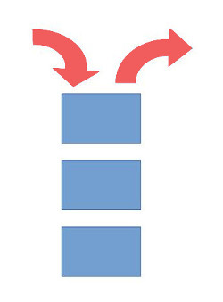

# Data Structures

Now that you have developed an understanding of function declarations and lists, let's have a look into more complicated data structures.

## List-Based Data Structures

Firstly, using your knowledge of lists in Solidity, let's implement a **stack** data structure.

The idea behind a stack is "first-on: last-off". That is, each new value is added to the front of the stack. When an item is removed, it is also removed from the front. This data structure can be useful for processing all sorts of data and solving unique problems - a good one to keep in mind for the future!

We are going to use the list data structure that we have already seen to more simply implement the stack. A `push` function is already implemented in Solidity which adds a value to the front of the list - just what we need!

However we need to be able to remove values from the from of the list too. This functionality is not automatically built-in so you need to implement it yourself to show your understanding.



Complete the implementation of the stack data structure below by implementing the remove() function.


pragma solidity ^0.4.24;

contract SpaceStorage {

  uint[] stack;

  // For insert, we simply 'push' the value onto the front of the stack.
  function insert(uint value) public returns (uint) {
    return stack.push(value);
  }

  // Implement the remove() funtion for the stack! Remember to update the stack length

}


pragma solidity ^0.4.24;

contract SpaceStorage {

  uint[] stack;

  function insert(uint value) public returns (uint) {
    return stack.push(value);
  }

  // Implement the remove() funtion for the stack! Remember to update the stack length
  function remove() public returns (uint value) {
    value = stack[stack.length - 1];
    stack.length = stack.length - 1;
  }

}


pragma solidity ^0.4.24;

import 'Assert.sol';
import 'SpaceStorage.sol';

contract TestSpaceStorage {

  SpaceStorage stack = SpaceStorage(__ADDRESS__);
  
    function testRemoveFirst() public {
    stack.insert(1);
    stack.insert(2);

    uint first = stack.remove();
    uint expected = 1;
    Assert.equal(first, expected, "First inserted value is not removed properly");
  }

    function testRemoveSecond() public {
    stack.insert(1);
    stack.insert(2);

    stack.remove();
    uint second = stack.remove();
    uint expected = 2;
    Assert.equal(second, expected, "Second inserted value is not removed properly");
  }

  event TestEvent(bool indexed result, string message);

}



Now that you've mastered a more complex data structure in Solidity, if you are interested in further data structures, try to have a look into binary search trees and hash tables.
